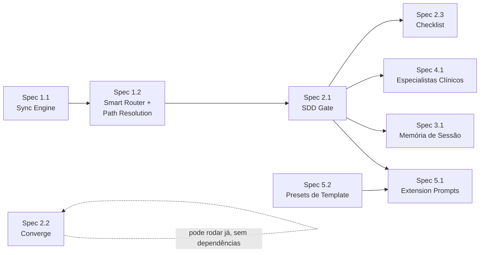

# Épico: Kit v0.4.0 — Integração SDD Completa (v2)

> **Status**: 🟡 Aguardando aprovação para início das Specs
> **Sessão de brainstorming original**: 2026-07-23
> **Sessão de auditoria e calibração**: 2026-07-23 (mesmo dia, sessão de continuação)
> **Decisões tomadas**: confirmadas pelo usuário nas duas sessões — ver `Changelog` no final

---

## Contexto e Motivação

O kit Vitalia foi construído em fases sucessivas sem integração total entre elas:

1. **`vitalia-agent-kit`** — CONTEXT.md monolítico, sem pipeline SDD.
2. **`vitalia-spec`** — pico de sofisticação: shards multi-máquina, DASHBOARD.md, CONSOLIDATION_LOG, loop de aprendizado no `session-end` (Fase 1: reflexão → `[KIT]`/`[PROJETO]`).
3. **`spec-agents` / `kit-v0.3.0` / `kit-v1.0.0`** — simplificação para `.vitalia/` + `feature.json`/`pipeline.json`. **Perdeu o loop de aprendizado e o histórico longitudinal** da fase anterior.
4. **Kit atual (v0.4.0)** — herdou a v0.3.0 sem mudança estrutural na camada de contexto; avançou apenas a Constituição (YAML + Bandeira de Parada Técnica).

O resultado são **dois sistemas paralelos**: o pipeline SDD formal e os skills diretos que o bypassam (`continue`, `pair`, `debug`). Além disso, a migração para v0.4.0 eliminou o "Smart Router" do `AGENTS.md` sem substituí-lo por um mecanismo equivalente, causando deriva comportamental ao trocar de modelo.

**Achados da auditoria desta sessão** (ver `Bugs Identificados`) confirmaram que a fragmentação é mais profunda do que o diagnóstico original:
- O repositório de contexto real em produção (`agente-local-context`) roda a arquitetura completa da era `vitalia-spec` (shards, dashboard, consolidation log) — **não** o formato simplificado que o kit atual documenta. O kit e a realidade operacional divergiram.
- Existem **5 formatos de spec concorrentes** (`software.spec.md`, `blueprint.spec.md`, `medical-gate.spec.md`, `spec.md.template`, e o template embutido no `spec-specify.toml`), sem hierarquia declarada entre eles.
- `session-start.toml` contém um bloco inteiro de outro domínio (revisão bibliográfica — PRISMA/Scopus/Web of Science) colado dentro do processo de início de sessão.
- Vários `.toml` fazem hardcode de paths (`.specify/memory/session/`, `~/.vitalia-spec/`) quando o Artigo XXIII exige agnosticismo de path resolvido por variável, não por string fixa.

**Objetivo deste épico**: usar a própria metodologia SDD — e os mecanismos do GitHub Spec Kit (Presets, `/speckit.checklist`, `/speckit.converge`) como referência de design — para integrar o kit consigo mesmo, tornando-o um sistema coerente, auto-melhorável e robusto à troca de modelos e de domínio.

---

## Decisões de Arquitetura (confirmadas)

### Princípios guia

- **Thin Client**: arquivos locais (`.agents/`, `.gemini/`) com mínimo de código. Lógica vive no kit global (`~/.vitalia/kit/`)
- **Lazy Loading**: Smart Router, Constituição e prompts de skills carregados on-demand, não always-on
- **Separação de responsabilidades**: cada arquivo tem uma responsabilidade, um dono e uma frequência de atualização
- **Single Source of Truth + Multiple Outputs**: YAML como fonte → MD gerado para leitura pelo agente
- **Git-Native Memory**: todos os artefatos de contexto são arquivos versionados
- **Agnosticismo de Path** *(reforçado nesta sessão)*: caminhos como `.vitalia/memory/session/` são valores resolvidos por variável em tempo de instalação — nunca strings fixas dentro de `.toml`. `.vitalia/memory/` é sempre **local ao projeto**; `~/.vitalia/kit/` é sempre **global e agnóstico** de qual projeto o está consumindo.
- **Um pipeline, múltiplos domínios** *(novo)*: todo domínio do kit (software, pedagógico, clínico, científico) roda sob o mesmo pipeline SDD (`specify → plan → tasks → analyze → implement`). Diferenças de domínio são resolvidas por customização de artefato (Presets), não por comandos paralelos.

### Formato do Smart Router

- **Fonte**: `~/.vitalia/kit/rules/always-on/smart-router.yaml` (arquivo separado da Constituição)
- **Output**: `~/.vitalia/kit/rules/always-on/smart-router.md` (gerado pelo sync script)
- **Carregamento**: on-demand pelo `vitalia-route`, nunca always-on

### Script de sincronização

- `sync-constitution.py` sem argumentos → atualiza **ambos** os arquivos
- Flag `--constitution` → só `architect-constitution.md`
- Flag `--router` → só `smart-router.md`

### vitalia-route

- Acionado apenas em invocações **implícitas** (linguagem natural sem slash command)
- Em invocações explícitas (`/vitalia-brainstorming`), o Antigravity carrega o shim diretamente
- Responsabilidade: ler `smart-router.md` e determinar o skill correto

### Resolução de paths agnóstica (install-time) *(novo — Decisão 2A)*

- Placeholders como `{{VITALIA_DIR}}` / `{{PROJECT_ROOT}}` existem nos `.toml` e templates fonte.
- `install-project.sh` resolve o valor real **no momento da instalação** e grava o resultado diretamente nos shims gerados (`.agents/skills/*/SKILL.md`, `.gemini/commands/*.toml`) — mesmo padrão que o GitHub Spec Kit usa para extensions/presets ("aplicados em install-time, escritos nos diretórios do agente").
- Nenhum `.toml` fonte no kit global contém string de path fixa (`.specify/`, `.vitalia/`, `~/.vitalia-spec/`) — todos usam o placeholder.

### Enriquecimento dos .toml (Princípio da Responsabilidade Única)

- Cada `.toml` contém apenas o comportamento **interno** do seu skill
- Roteamento pós-skill (ex: "após brainstorming, use spec-specify") → `vitalia-route`
- Regras de processo → `architect-constitution.yaml`
- `session-start.toml` contém **apenas** o processo de início de sessão — nenhum conteúdo específico de um domínio ou projeto (correção do achado de contaminação desta sessão)

### Templates de domínio via Presets *(novo — Decisão A: 1A)*

- Comando único por fase do pipeline: `/vitalia-spec-specify`, `/vitalia-spec-plan`, etc. — **não** comandos paralelos por domínio (`blueprint-specify` deixa de existir como comando separado).
- Cada domínio (software, pedagógico, clínico) é um **preset** que sobrescreve apenas a seção de template do artefato gerado — resolução em runtime, prioridade em pilha, igual ao mecanismo de Presets do Spec Kit.
- Os 5 formatos de spec hoje concorrentes (`software.spec.md`, `blueprint.spec.md`, `medical-gate.spec.md`, `spec.md.template`, template embutido em `spec-specify.toml`) convergem para **um preset cada**, com o pipeline (`analyze`, `implement`) compartilhado entre todos.
- `spec-quality-blueprint.md` (regra always-on que hoje prescreve um 6º formato, voltado a UI/frontend) também vira preset, não regra global — evita que toda spec, independente de domínio, seja forçada a ter seções de Design System.

### `/vitalia-checklist` — comando dedicado + sugestão contextual *(novo — Decisão B: 4A + B1)*

- Extensão nova, independente, chamável a qualquer momento sobre qualquer spec — não embutida automaticamente no `spec-specify`.
- **Sugestão por contexto** via hook em `extensions.yml` (mesmo padrão já usado por `after_tasks: analyze`):
  ```yaml
  after_specify:
    - extension: checklist
      command: vitalia-checklist
      optional: true
  after_plan:
    - extension: checklist
      command: vitalia-checklist
      optional: true
  ```
- `optional: true` = sugestão, nunca bloqueio. Reusa infraestrutura de hooks que já existe — não depende do Smart Router (Spec 1.1/1.2) estar pronto.

### `/vitalia-converge` — dogfooding do próprio pipeline *(novo — Decisão C: 5A)*

- Extensão nova (já prototipada nesta sessão — ver `extensions/converge.toml`), construída **agora**, não adiada.
- Avalia o código/arquivos reais de uma feature contra `spec.md`/`plan.md`/`tasks.md` — não confia no estado declarado (`[x]`/`[ ]`), verifica evidência.
- Primeira aplicação real: reconciliar `specs/v0.4.0/vitalia-kit.tasks.md`, que está com todas as tasks `[ ]` mesmo com a maior parte do trabalho já implementada no repositório (confirmado nesta sessão: T01.1–T01.4, T02.1–T02.2, T03.1 têm evidência real de conclusão; T03.2 está parcial — o `spec.md.template` existe mas ficou com 4 seções em vez das 5 prometidas no `plan.md`; T04.1 é genuinamente pendente).
- Diferença de `/vitalia-spec-analyze`: `analyze` compara spec↔plan↔tasks entre si (terminologia, cobertura). `converge` compara esse conjunto **contra o código real**.

### SDD Gate nos skills que tocam código

Skills `continue`, `pair`, `debug` devem verificar spec ativa ANTES de qualquer código:
```
Passo 0 obrigatório:
1. Verificar existência de specs/[feature]/tasks.md com tasks pendentes
2. SE NÃO → Technical Stop Flag + redirect para /vitalia-spec-specify
3. SE SIM → verificar se ação solicitada está no escopo da spec ativa
```

### Arquitetura de memória de sessão (3 camadas)

```
.vitalia/context/
├── SESSION_STATE.md   ← Tier 1: estado ativo (P0, branch, feature, arquivos)
│   Máx: 300 tokens. Atualizado por session-end.
├── DECISIONS.md       ← Tier 2: decisões arquiteturais (ADRs compactos)
│   Append-only. Nunca sobrescrito.
└── LEARNINGS.md       ← Tier 2: aprendizados classificados por escopo
    [KIT] → spec de melhoria do kit
    [PROJETO] → backlog do projeto
```

> **Nota de reconciliação com produção** *(nova)*: o repositório `agente-local-context` já roda `shards/`, `DASHBOARD.md`, `SESSION_HISTORY.md` e `CONSOLIDATION_LOG.md` — a arquitetura completa da era `vitalia-spec`. A Spec 3.1 não parte do zero: ela precisa **portar** `generate_context_readme.py` e a lógica de shard/lock (hoje órfãs, sem estar em `~/.vitalia/kit/scripts/`) para o kit global, com paths resolvidos por variável de instalação — não recriar o mecanismo do zero.

### Dashboard do repositório de contexto

- Base: `generate_context_readme.py` da `vitalia-spec` / `kit-v1.0.0` (confirmado nesta sessão como o script real por trás do dashboard hoje ativo em `agente-local-context`)
- 5 melhorias incrementais (confirmadas):
  1. Parametrizar nome do projeto (lido de `SESSION_STATE.md`)
  2. Extrair e exibir P0 de cada shard
  3. Badge de staleness (⚠️ se shard > 24h sem sync)
  4. Seção "📝 Aprendizados Pendentes" (do `LEARNINGS.md`)
  5. Fix dos labels Mermaid (timestamps com parênteses)

### Epistemologia do Agente (novo Artigo na Constituição)

Instrução "não confie em conhecimento interno" vira Artigo na Constituição — efeito global, não apenas nos prompts de analyze. Aplica-se também ao `/vitalia-converge`: nenhuma conclusão sobre "o que já foi feito" sem verificação direta de arquivo.

---

## Estrutura do Épico: 5 Áreas, 10 Specs

> Sequência de dependências: `1.1 → 1.2 → 2.1` | `2.2 pode começar assim que existir 1 feature com spec+plan+tasks (não depende de 1.x/2.1)` | `2.3, 3.1, 4.1 paralelas com 2.1` | `5.1 depende de 2.1` | `5.2 independente, mas idealmente antes de 5.1`

```
ÉPICO: Kit v0.4.0 — Integração SDD Completa

Área 1 — Infraestrutura de Governança
  Spec 1.1: Sync Engine (smart-router.yaml + sync script com flags)
  Spec 1.2: Smart Router em runtime + Resolução de Paths por Variável
             (vitalia-route + AGENTS.md mínimos + {{VITALIA_DIR}} resolvido
             em install-time, eliminando hardcode de .specify/ e ~/.vitalia-spec/)

Área 2 — Pipeline SDD com Gates Reais
  Spec 2.1: SDD Gate em continue, pair, debug (Passo 0 obrigatório)
  Spec 2.2: /vitalia-converge — Convergência Spec↔Código
             Já prototipado. Primeira aplicação: reconciliar tasks.md do v0.4.0.
  Spec 2.3: /vitalia-checklist — comando dedicado + hook de sugestão contextual
             (after_specify/after_plan em extensions.yml, optional: true)

Área 3 — Arquitetura de Memória de Sessão
  Spec 3.1: SESSION_STATE + DECISIONS + LEARNINGS + session workflows
             + Dashboard melhorado (5 melhorias do generate_context_readme.py)
             + session-start.toml limpo (remover contaminação de outro domínio)
             + reconciliação com a arquitetura já ativa em agente-local-context

Área 4 — Especialistas Clínicos no Pipeline SDD
  Spec 4.1: clinical-constraints.md como artefato formal
             Fluxo: medical-gate → specialist → clinical-constraints.md
             analyze.toml verifica cobertura → spec-implement lê constraints

Área 5 — Enriquecimento das Extensions e Unificação de Templates
  Spec 5.1: 21+ .toml com prompts autocontidos
             Parte A: comportamento explícito por skill (brainstorming socrático, etc.)
             Parte B: SDD Gate integrado nos 5 que tocam código
             + Artigo Epistemologia na Constituição
  Spec 5.2: Mecanismo de Presets para templates de domínio
             Resolve os 5 formatos de spec concorrentes (software.spec.md,
             blueprint.spec.md, medical-gate.spec.md, spec.md.template, template
             embutido em spec-specify.toml) + reconcilia spec-quality-blueprint.md
             (hoje regra always-on) como preset de domínio UI/frontend
```

---

## Sequência de Execução



**Por que esta ordem:**
- `1.1` primeiro: `smart-router.yaml` precisa existir antes de qualquer referência a ele
- `1.2` segundo: `vitalia-route` lê o arquivo gerado pela 1.1, e é o ponto certo para resolver o agnosticismo de path (o mesmo mecanismo de install-time serve para paths e para o router)
- `2.2` (`converge`) é a única spec **sem dependência** — o protótipo já existe e pode ser usado imediatamente para reconciliar o próprio `tasks.md` do v0.4.0, servindo de dogfooding do épico enquanto o resto avança
- `2.1` antes de `5.1`: o Passo 0 (SDD gate) é o que valida o comportamento dos prompts
- `2.3`, `3.1` e `4.1` paralelas com `2.1`: sem dependência entre si
- `5.2` antes de `5.1`: definir o mecanismo de Presets primeiro evita que o enriquecimento de prompts da 5.1 seja feito em cima de templates que ainda vão mudar de formato
- `5.1` por último: enriquece todos os `.toml` com comportamento + gate integrado, já sobre a base de Presets estabilizada

---

## Bugs Identificados (a corrigir durante as Specs)

| ID | Localização | Bug | Corrigido em |
|---|---|---|---|
| BUG-01 | `extensions/session-start.toml` | Path legado `~/.vitalia-spec/` (não existe mais) | Spec 1.2 |
| BUG-02 | `install-project.sh` linha 172-175 | `sed` com delimitador quebrado — `{{NAME}}` e `{{DESCRIPTION}}` nunca substituídos | Spec 1.2 |
| BUG-03 | `AGENTS.md` local | Referencia caminho legado em instruções | Spec 1.2 |
| BUG-04 | Todos os shims | `SKILL.md` com `description` truncada no `.toml` (efeito colateral do BUG-02) | Spec 1.2 |
| BUG-05 *(novo)* | `extensions/session-start.toml`, linhas 86–150 | Bloco inteiro de domínio de revisão bibliográfica (PRISMA/Scopus/Web of Science/`/integrative-review`) colado dentro do processo de início de sessão | Spec 3.1 |
| BUG-06 *(novo)* | `session-*.toml`, `session-context.md` | Paths `.specify/memory/session/` hardcoded como string fixa — deveriam ser placeholder resolvido em install-time, não substituídos por outra string fixa | Spec 1.2 / Spec 3.1 |
| BUG-07 *(novo)* | `session-start.toml`, `session-end.toml`, `session-consolidate.toml`, `skill-evaluation.toml` | Instruem scripts (`validate-kit.py`, `session-resolve.sh`, `timestamp_enforcer.py`, `lib_machine.py`, `generate_context_readme.py`) que não foram reescritos em `~/.vitalia/kit/scripts/` — órfãos de um kit legado, embora o comportamento que produzem esteja ativo em produção (`agente-local-context`) | Spec 3.1 |
| BUG-08 *(novo)* | `VERSION` | Reporta `0.3.0`; kit já tem trabalho funcional de v0.4.0 (constitution YAML, Bandeira de Parada) | Spec 5.1 |
| BUG-09 *(novo)* | `scripts/bootstrap.sh` linha 16 | `REQUIRED_VERSION="0.3.0"` hardcoded — deveria ler de `VERSION` ou ser dinâmico | Spec 5.1 |
| BUG-10 *(novo)* | `integrations/antigravity/SKILL.md.template` | Comentário HTML fixo menciona "Vitalia Kit 0.3" | Spec 1.2 |
| BUG-11 *(novo)* | Todas as 20+ extensions | `version = "0.3.0"` em todos os `.toml`, nenhum reflete o trabalho de v0.4.0 já feito | Spec 5.1 |
| BUG-12 *(novo)* | `templates/` (5 arquivos) + `rules/always-on/spec-quality-blueprint.md` | 5-6 formatos de spec concorrentes, sem hierarquia declarada, sem uso consistente pelas extensions | Spec 5.2 |
| ITEM-13 *(novo, não é bug, é achado de auditoria)* | `specs/v0.4.0/vitalia-kit.tasks.md` | Tasks T01–T03 majoritariamente `[ ]` apesar de evidência real de conclusão no repositório; T03.2 parcial (template com 4 de 5 seções prometidas) | Spec 2.2 (primeira aplicação do `/vitalia-converge`) |

---

## Artefatos desta Sessão de Brainstorming e Auditoria

| Artefato | Conteúdo |
|---|---|
| Análise de Arquitetura | Opções A/B/C/D de onde mora o "cérebro" do kit; escolha da Opção D híbrida |
| Auditoria do Kit | 8 inconsistências identificadas por leitura direta dos arquivos (base dos BUG-01 a BUG-10 acima) |
| Análise de Contexto | 5 versões de gestão de contexto comparadas + estratégia de 3 tiers |
| `extensions/converge.toml` | Protótipo funcional da Spec 2.2, já escrito nesta sessão |

---

## Changelog

- **2026-07-23 (sessão original)**: Épico criado — 5 Áreas, 7 Specs.
- **2026-07-23 (sessão de auditoria)**: Leitura direta do kit v0.3.0 real + verificação ao vivo de `agente-local-context` + assimilação do GitHub Spec Kit como parâmetro de design. Adicionadas Spec 2.2 (Converge), Spec 2.3 (Checklist), Spec 5.2 (Presets). Adicionados BUG-05 a BUG-12. Reforçado o princípio de agnosticismo de path (resolução por variável em install-time, não substituição de string fixa por outra string fixa).
