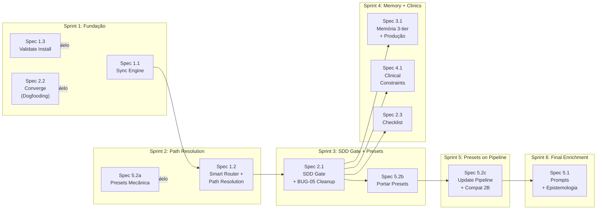

# Épico: Kit v0.4.0 — Integração SDD Completa (v3)

> **Status**: 🟢 APROVADO PARA EXECUÇÃO  
> **Sessão de brainstorming**: 2026-07-23  
> **Sessão de auditoria**: 2026-07-23  
> **Sessão de refinamento e sugestões**: 2026-07-23  
> **Decisões**: Confirmadas pelo usuário em todas as 3 sessões — ver `Changelog` no final  

---

## Contexto e Motivação

O kit Vitalia foi construído em fases sucessivas sem integração total entre elas:

1. **`vitalia-agent-kit`** — CONTEXT.md monolítico, sem pipeline SDD.
2. **`vitalia-spec`** — pico de sofisticação: shards multi-máquina, DASHBOARD.md, CONSOLIDATION_LOG, loop de aprendizado no `session-end` (Fase 1: reflexão → `[KIT]`/`[PROJETO]`).
3. **`spec-agents` / `kit-v0.3.0` / `kit-v1.0.0`** — simplificação para `.vitalia/` + `feature.json`/`pipeline.json`. **Perdeu o loop de aprendizado e o histórico longitudinal** da fase anterior.
4. **Kit atual (v0.4.0)** — herdou a v0.3.0 sem mudança estrutural na camada de contexto; avançou apenas a Constituição (YAML + Bandeira de Parada Técnica).

O resultado são **dois sistemas paralelos**: o pipeline SDD formal e os skills diretos que o bypassam (`continue`, `pair`, `debug`). Além disso, a migração para v0.4.0 eliminou o "Smart Router" do `AGENTS.md` sem substituí-lo por um mecanismo equivalente, causando deriva comportamental ao trocar de modelo.

**Achados da auditoria** (Sessão 2) confirmaram que a fragmentação é mais profunda do que o diagnóstico original:
- O repositório de contexto real em produção (`agente-local-context`) roda a arquitetura completa da era `vitalia-spec` (shards, dashboard, consolidation log) — **não** o formato simplificado que o kit atual documenta. O kit e a realidade operacional divergiram.
- Existem **5 formatos de spec concorrentes** (`software.spec.md`, `blueprint.spec.md`, `medical-gate.spec.md`, `spec.md.template`, template embutido em `spec-specify.toml`), sem hierarquia declarada entre eles.
- `session-start.toml` contém um bloco inteiro de outro domínio (revisão bibliográfica — PRISMA/Scopus/Web of Science) colado dentro do processo de início de sessão.
- Vários `.toml` fazem hardcode de paths (`.specify/memory/session/`, `~/.vitalia-spec/`) quando o Artigo XXIII exige agnosticismo de path resolvido por variável, não por string fixa.

**Objetivo deste épico**: usar a própria metodologia SDD — e os mecanismos do GitHub Spec Kit (Presets, `/speckit.checklist`, `/speckit.converge`) como referência de design — para integrar o kit consigo mesmo, tornando-o um sistema coerente, auto-melhorável e robusto à troca de modelos e de domínio.

---

## Decisões de Arquitetura (confirmadas)

### Princípios guia

- **Thin Client**: arquivos locais (`.agents/`, `.gemini/`) com mínimo de código. Lógica vive no kit global (`~/.vitalia/kit/`)
- **Lazy Loading**: Smart Router, Constituição e prompts de skills carregados on-demand, não always-on
- **Separação de responsabilidades**: cada arquivo tem uma responsabilidade, um dono e uma frequência de atualização
- **Single Source of Truth + Multiple Outputs**: YAML como fonte → MD gerado para leitura pelo agente
- **Git-Native Memory**: todos os artefatos de contexto são arquivos versionados
- **Agnosticismo de Path** *(Decisão 2A)*: caminhos como `.vitalia/memory/session/` são valores resolvidos por variável em **install-time** — nunca strings fixas dentro de `.toml`. `.vitalia/memory/` é sempre **local ao projeto**; `~/.vitalia/kit/` é sempre **global e agnóstico** de qual projeto o está consumindo.
  - Placeholders como `{{VITALIA_DIR}}` / `{{PROJECT_ROOT}}` existem nos `.toml` fontes
  - `install-project.sh` resolve o valor real **no momento da instalação** e substitui nos shims gerados
  - **Nenhum `.toml` fonte contém string de path fixa** — todos usam placeholder
- **Um pipeline, múltiplos domínios**: todo domínio do kit (software, pedagógico, clínico, científico) roda sob o mesmo pipeline SDD (`specify → plan → tasks → analyze → implement`). Diferenças de domínio são resolvidas por customização de artefato via **Presets** (Decisão A), não por comandos paralelos.

### Formato do Smart Router

- **Fonte**: `~/.vitalia/kit/rules/always-on/smart-router.yaml` (arquivo separado da Constituição)
- **Output**: `~/.vitalia/kit/rules/always-on/smart-router.md` (gerado pelo sync script)
- **Carregamento**: on-demand pelo `vitalia-route`, nunca always-on

### Script de sincronização

- `sync-constitution.py` sem argumentos → atualiza **ambos** os arquivos
- Flag `--constitution` → só `architect-constitution.md`
- Flag `--router` → só `smart-router.md`

### vitalia-route

- Acionado apenas em invocações **implícitas** (linguagem natural sem slash command)
- Em invocações explícitas (`/vitalia-brainstorming`), o Antigravity carrega o shim diretamente
- Responsabilidade: ler `smart-router.md` e determinar o skill correto

### Enriquecimento dos .toml (Princípio da Responsabilidade Única)

- Cada `.toml` contém apenas o comportamento **interno** do seu skill
- Roteamento pós-skill (ex: "após brainstorming, use spec-specify") → `vitalia-route`
- Regras de processo → `architect-constitution.yaml`
- `session-start.toml` contém **apenas** o processo de início de sessão — nenhum conteúdo específico de um domínio ou projeto (correção do achado de contaminação desta sessão)

### Templates de domínio via Presets *(Decisão A: 1A — Refatorado em Spec 5.2)*

- Comando único por fase do pipeline: `/vitalia-spec-specify`, `/vitalia-spec-plan`, etc. — **não** comandos paralelos por domínio (`blueprint-specify` deixa de existir como comando separado).
- Cada domínio (software, pedagógico, clínico) é um **preset** que sobrescreve apenas a seção de template do artefato gerado — resolução em **runtime**, prioridade em pilha, igual ao mecanismo de Presets do Spec Kit.
- Os 5 formatos de spec hoje concorrentes (`software.spec.md`, `blueprint.spec.md`, `medical-gate.spec.md`, `spec.md.template`, template embutido em `spec-specify.toml`) convergem para **um preset cada**, com o pipeline (`analyze`, `implement`) compartilhado entre todos.
- `spec-quality-blueprint.md` (regra always-on que hoje prescreve um 6º formato, voltado a UI/frontend) também vira preset, não regra global — evita que toda spec, independente de domínio, seja forçada a ter seções de Design System.

### Compatibilidade Reversa *(Decisão 2B — NEW)*

- Comandos obsoletos (`/blueprint-specify`, `/blueprint-plan`, `/spec-quality-blueprint` como regra global) rodarão como **shims** que fazem redirect + sugestão de preset, não breaking changes
- Exemplo: `/blueprint-specify "um curso de Python"` → carrega `/vitalia-spec-specify` com `--preset=educational` + mensagem "Este comando está deprecado; use /vitalia-spec-specify --preset=educational"
- Transição suave para v0.4.0; sunset path documentado em CHANGELOG

### SDD Gate nos skills que tocam código

Skills `continue`, `pair`, `debug` devem verificar spec ativa ANTES de qualquer código:
```
Passo 0 obrigatório:
1. Verificar existência de specs/[feature]/tasks.md com tasks pendentes
2. SE NÃO → Technical Stop Flag + redirect para /vitalia-spec-specify
3. SE SIM → verificar se ação solicitada está no escopo da spec ativa
```

### Arquitetura de memória de sessão (3 camadas)

```
.vitalia/context/
├── SESSION_STATE.md   ← Tier 1: estado ativo (P0, branch, feature, arquivos)
│   Máx: 300 tokens. Atualizado por session-end.
├── DECISIONS.md       ← Tier 2: decisões arquiteturais (ADRs compactos)
│   Append-only. Nunca sobrescrito.
└── LEARNINGS.md       ← Tier 2: aprendizados classificados por escopo
    [KIT] → spec de melhoria do kit
    [PROJETO] → backlog do projeto
```

**Nota de reconciliação com produção**: o repositório `agente-local-context` já roda a arquitetura completa (`shards/`, `DASHBOARD.md`, `SESSION_HISTORY.md`, `CONSOLIDATION_LOG.md`) da era `vitalia-spec`. A Spec 3.1 não parte do zero: ela precisa **portar** scripts órfãos (`generate_context_readme.py`, lógica de shard/lock) para o kit global, com paths resolvidos por variável de instalação — não recriar o mecanismo.

### Dashboard do repositório de contexto

- Base: `generate_context_readme.py` da `vitalia-spec` / `kit-v1.0.0` (script real por trás do dashboard ativo em `agente-local-context`)
- 5 melhorias incrementais:
  1. Parametrizar nome do projeto (lido de `SESSION_STATE.md`)
  2. Extrair e exibir P0 de cada shard
  3. Badge de staleness (⚠️ se shard > 24h sem sync)
  4. Seção "📝 Aprendizados Pendentes" (do `LEARNINGS.md`)
  5. Fix dos labels Mermaid (timestamps com parênteses)

### Epistemologia do Agente (novo Artigo na Constituição)

Instrução "não confie em conhecimento interno" vira Artigo V na Constituição — efeito global, não apenas nos prompts de analyze. Aplica-se também ao `/vitalia-converge`: nenhuma conclusão sobre "o que já foi feito" sem verificação direta de arquivo.

---

## Estrutura do Épico: 5 Áreas, 11 Specs

> **Sequência de dependências**: `1.1 → 1.2 → 2.1` | `1.3, 2.2 independentes` | `2.3, 3.1, 4.1 paralelas com 2.1` | `5.2a, 5.2b, 5.2c sequenciais` | `5.1 por último`

```
ÉPICO: Kit v0.4.0 — Integração SDD Completa

Área 1 — Infraestrutura de Governança
  Spec 1.1: Sync Engine (smart-router.yaml + sync script com flags)
  Spec 1.2: Smart Router em runtime + Resolução de Paths por Variável
             (vitalia-route + AGENTS.md mínimos + {{VITALIA_DIR}} resolvido
             em install-time, eliminando hardcode de .specify/ e ~/.vitalia-spec/)
  Spec 1.3: Validação de Install (validate-kit-install.sh)
             Verifica: sem {{...}} sobrando, paths existem, hooks resolvem

Área 2 — Pipeline SDD com Gates Reais
  Spec 2.1: SDD Gate em continue, pair, debug (Passo 0 obrigatório)
             + cleanup de BUG-05 (remove contaminação bibliográfica de session-start.toml)
             + novo skill opcional: /vitalia-integrative-review (destino do bloco removido)
  Spec 2.2: /vitalia-converge — Convergência Spec↔Código
             Já prototipado. Primeira aplicação: reconciliar tasks.md do v0.4.0.
  Spec 2.3: /vitalia-checklist — comando dedicado + hook de sugestão contextual
             (after_specify/after_plan em extensions.yml, optional: true)

Área 3 — Arquitetura de Memória de Sessão
  Spec 3.1: SESSION_STATE + DECISIONS + LEARNINGS + session workflows
             + Dashboard melhorado (5 melhorias do generate_context_readme.py)
             + Integração com produção: portar scripts órfãos de agente-local-context
             + session-start.toml limpo (contaminação já saiu em Spec 2.1)

Área 4 — Especialistas Clínicos no Pipeline SDD
  Spec 4.1: clinical-constraints.md como artefato formal
             Fluxo: medical-gate → specialist → clinical-constraints.md
             analyze.toml verifica cobertura → spec-implement lê constraints

Área 5 — Enriquecimento das Extensions e Unificação de Templates
  Spec 5.1: 21+ .toml com prompts autocontidos + SDD Gate integrado
             + Artigo V (Epistemologia) na Constituição
             + Update version em todos .toml e VERSION file para 0.4.0
             Parte A: comportamento explícito por skill (brainstorming socrático, etc.)
             Parte B: SDD Gate integrado nos 5 que tocam código
  Spec 5.2a: Mecanismo de Plugin System para Presets
              Infraestrutura: load/override/priority (sem aplicar ainda)
  Spec 5.2b: Portar 5-6 formatos de spec concorrentes como Presets
              software.spec.md, blueprint.spec.md, medical-gate.spec.md,
              spec.md.template, spec-quality-blueprint (deixa de ser regra global)
  Spec 5.2c: Atualizar pipeline (spec-specify.toml, analyze.toml) para usar Presets
              + Implementar Decisão 2B: shims para comandos legados com deprecation
```

---

## Sequência de Execução (6 Sprints)



**Por que esta ordem:**
- **Sprint 1** — `1.1` primeiro: `smart-router.yaml` precisa existir. `1.3` paralelo (valida install). `2.2` paralelo (dogfooding vivo, independente).
- **Sprint 2** — `1.2` depende de `1.1`. `5.2a` paralelo (define infraestrutura, sem aplicar).
- **Sprint 3** — `2.1` depende de `1.2` (resolve paths). BUG-05 sai aqui (antes de refatorar memória). `5.2b` começa a portar presets.
- **Sprint 4** — `3.1`, `4.1`, `2.3` paralelas (sem dependência entre si). `3.1` portar scripts produção first.
- **Sprint 5** — `5.2c` integra presets no pipeline; implementa Decisão 2B (shims compatibilidade).
- **Sprint 6** — `5.1` enriquece prompts + Epistemologia, agora sobre base estável.

---

## Bugs Identificados (a corrigir durante as Specs)

| ID | Localização | Bug | Corrigido em | Criticidade |
|---|---|---|---|---|
| BUG-01 | `extensions/session-start.toml` | Path legado `~/.vitalia-spec/` (não existe mais) | Spec 1.2 | 🟡 MEDIUM |
| BUG-02 | `install-project.sh` linha 172-175 | `sed` com delimitador quebrado — `{{NAME}}` e `{{DESCRIPTION}}` nunca substituídos | Spec 1.2 | 🔴 CRITICAL |
| BUG-03 | `AGENTS.md` local | Referencia caminho legado em instruções | Spec 1.2 | 🟡 MEDIUM |
| BUG-04 | Todos os shims | `SKILL.md` com `description` truncada no `.toml` (efeito colateral do BUG-02) | Spec 1.2 | 🟡 MEDIUM |
| BUG-05 | `extensions/session-start.toml`, linhas 86–150 | Bloco inteiro de domínio de revisão bibliográfica (PRISMA/Scopus/Web of Science/`/integrative-review`) colado dentro do processo de início de sessão | Spec 2.1 | 🔴 CRITICAL |
| BUG-06 | `session-*.toml`, `session-context.md` | Paths `.specify/memory/session/` hardcoded como string fixa — deveriam ser placeholder resolvido em install-time | Spec 1.2 | 🔴 CRITICAL |
| BUG-07 | `session-*.toml`, `session-context.md` | Instruem scripts órfãos (`validate-kit.py`, `session-resolve.sh`, `timestamp_enforcer.py`, `lib_machine.py`, `generate_context_readme.py`) não em `~/.vitalia/kit/scripts/` | Spec 3.1 | 🔴 CRITICAL |
| BUG-08 | `VERSION` | Reporta `0.3.0`; kit já tem trabalho funcional de v0.4.0 (constitution YAML, Bandeira de Parada) | Spec 5.1 | 🟢 TRIVIAL |
| BUG-09 | `scripts/bootstrap.sh` linha 16 | `REQUIRED_VERSION="0.3.0"` hardcoded — deveria ler de `VERSION` ou ser dinâmico | Spec 5.1 | 🟢 TRIVIAL |
| BUG-10 | `integrations/antigravity/SKILL.md.template` | Comentário HTML fixo menciona "Vitalia Kit 0.3" | Spec 1.2 | 🟢 LOW |
| BUG-11 | Todas as 20+ extensions | `version = "0.3.0"` em todos os `.toml`, nenhum reflete o trabalho de v0.4.0 já feito | Spec 5.1 | 🟡 COSMETIC |
| BUG-12 | `templates/` (5 arquivos) + `rules/always-on/spec-quality-blueprint.md` | 5-6 formatos de spec concorrentes, sem hierarquia declarada, sem uso consistente pelas extensions | Spec 5.2b | 🔴 CRITICAL |
| ITEM-13 | `specs/v0.4.0/vitalia-kit.tasks.md` | Tasks T01–T03 majoritariamente `[ ]` apesar de evidência real de conclusão no repositório; T03.2 parcial (template com 4 de 5 seções prometidas) | Spec 2.2 (primeira aplicação do `/vitalia-converge`) | 🟢 INFO |

---

## Changelog

- **2026-07-23 (Sessão 1: Brainstorming)**: Épico criado — 5 Áreas, 7 Specs. Decisões A, 2A, Smart Router, SDD Gate.
- **2026-07-23 (Sessão 2: Auditoria)**: Leitura direta do kit v0.3.0 real + verificação ao vivo de `agente-local-context`. Adicionadas Spec 2.2 (Converge), Spec 2.3 (Checklist), Spec 5.2 (Presets). Adicionados BUG-05 a BUG-12.
- **2026-07-23 (Sessão 3: Refinamento + Sugestões)**:
  - **S1**: Decompor Spec 5.2 em 3 fases (5.2a/5.2b/5.2c) — melhor feedback iterativo
  - **S2**: Adicionar Spec 1.3 (Validação de Install) — previne bugs de install
  - **S3**: Spec 2.2 (Converge) como dogfooding vivo — começa Sprint 1
  - **S4**: BUG-05 corrigido em Spec 2.1, não Spec 3.1 — contamination cleanup antes de refatorar memória
  - **S5**: Decisão 2B explícita — compatibilidade reversa via shim, não breaking changes
  - **S6**: Spec 3.1 prioriza integração com produção — portar scripts órfãos **antes** de novo features
  - **S7**: Spec 5.1 é 4A paralela — começa com Spec 3.1/4.1, respeitando constraint de Presets
  - **Cronograma**: 6 Sprints (semanas), 11 Specs totais

---

## Recursos & Artefatos por Spec

| Spec | Arquivos Criados | Arquivos Modificados | Novos Skills | Removidos |
|---|---|---|---|---|
| 1.1 | `smart-router.yaml` | `sync-constitution.py` | — | — |
| 1.2 | `vitalia-route.toml` | `install-project.sh`, AGENTS.md, `SKILL.md.template` | vitalia-route | — |
| 1.3 | `validate-kit-install.sh` | — | — | — |
| 2.1 | `vitalia-integrative-review.toml` | `continue.toml`, `pair.toml`, `debug.toml`, `session-start.toml` | vitalia-integrative-review | — |
| 2.2 | `extensions/converge.toml` | — | vitalia-converge | — |
| 2.3 | `extensions/checklist.toml` | `extensions.yml` (template) | vitalia-checklist | — |
| 3.1 | `SESSION_STATE.md` (template), `DECISIONS.md` (template), `LEARNINGS.md` (template), scripts portados | `session-start.toml`, `session-end.toml`, `session-consolidate.toml`, `skill-evaluation.toml` | — | — |
| 4.1 | `clinical-constraints.md` (template) | `medical-gate.toml`, `analyze.toml`, `spec-implement.toml` | — | — |
| 5.2a | `config/presets.yaml`, preset loading code | — | — | — |
| 5.2b | `presets/software.md`, `presets/educational.md`, `presets/clinical.md`, etc. | — | — | `/blueprint-specify` (shim), `/blueprint-plan` (shim) |
| 5.2c | — | `spec-specify.toml`, `analyze.toml` | — | `/spec-quality-blueprint` (regra global vira preset) |
| 5.1 | `architect-constitution-v0.4.0.md` (com Art. V) | Todos os 21+ `.toml`, `VERSION`, `bootstrap.sh` | — | — |
