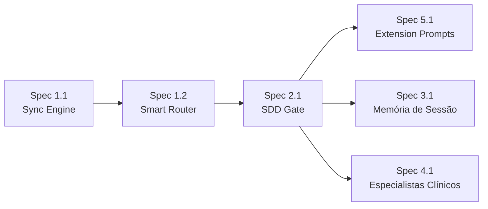

# Épico: Kit v0.4.0 — Integração SDD Completa

> **Status**: 🟡 Aguardando aprovação para início das Specs
> **Sessão de brainstorming**: 2026-07-23
> **Decisões tomadas**: todas confirmadas pelo usuário nesta sessão

---

## Contexto e Motivação

O kit Vitalia foi construído em duas fases sem integração:

1. **Fase 1** — Coleção de skills de produtividade (continue, pair, debug, brainstorming, session management)
2. **Fase 2** — Metodologia SDD adicionada por cima (Constituição com Artigo I, analyze gate)

O resultado são **dois sistemas paralelos**: o pipeline SDD formal e os skills diretos que o bypassam. Além disso, a migração para v0.4.0 eliminou o "Smart Router" do `AGENTS.md` sem substituí-lo por um mecanismo equivalente, causando deriva comportamental ao trocar de modelo.

**Objetivo deste épico**: usar a própria metodologia SDD para integrar o kit consigo mesmo — tornando-o um sistema coerente, auto-melhorável e robusto à troca de modelos.

---

## Decisões de Arquitetura (confirmadas)

### Princípios guia

- **Thin Client**: arquivos locais (`.agents/`, `.gemini/`) com mínimo de código. Lógica vive no kit global (`~/.vitalia/kit/`)
- **Lazy Loading**: Smart Router, Constituição e prompts de skills carregados on-demand, não always-on
- **Separação de responsabilidades**: cada arquivo tem uma responsabilidade, um dono e uma frequência de atualização
- **Single Source of Truth + Multiple Outputs**: YAML como fonte → MD gerado para leitura pelo agente
- **Git-Native Memory**: todos os artefatos de contexto são arquivos versionados

### Formato do Smart Router

- **Fonte**: `~/.vitalia/kit/rules/always-on/smart-router.yaml` (arquivo separado da Constituição)
- **Output**: `~/.vitalia/kit/rules/always-on/smart-router.md` (gerado pelo sync script)
- **Carregamento**: on-demand pelo `vitalia-route`, nunca always-on

### Script de sincronização

- `sync-constitution.py` sem argumentos → atualiza **ambos** os arquivos
- Flag `--constitution` → só `architect-constitution.md`
- Flag `--router` → só `smart-router.md`

### vitalia-route

- Acionado apenas em invocações **implícitas** (linguagem natural sem slash command)
- Em invocações explícitas (`/vitalia-brainstorming`), o Antigravity carrega o shim diretamente
- Responsabilidade: ler `smart-router.md` e determinar o skill correto

### Enriquecimento dos .toml (Princípio da Responsabilidade Única)

- Cada `.toml` contém apenas o comportamento **interno** do seu skill
- Roteamento pós-skill (ex: "após brainstorming, use spec-specify") → `vitalia-route`
- Regras de processo → `architect-constitution.yaml`

### SDD Gate nos skills que tocam código

Skills `continue`, `pair`, `debug` devem verificar spec ativa ANTES de qualquer código:
```
Passo 0 obrigatório:
1. Verificar existência de specs/[feature]/tasks.md com tasks pendentes
2. SE NÃO → Technical Stop Flag + redirect para /vitalia-spec-specify
3. SE SIM → verificar se ação solicitada está no escopo da spec ativa
```

### Arquitetura de memória de sessão (3 camadas)

```
.vitalia/context/
├── SESSION_STATE.md   ← Tier 1: estado ativo (P0, branch, feature, arquivos)
│   Máx: 300 tokens. Atualizado por session-end.
├── DECISIONS.md       ← Tier 2: decisões arquiteturais (ADRs compactos)
│   Append-only. Nunca sobrescrito.
└── LEARNINGS.md       ← Tier 2: aprendizados classificados por escopo
    [KIT] → spec de melhoria do kit
    [PROJETO] → backlog do projeto
```

### Dashboard do repositório de contexto

- Base: `generate_context_readme.py` da `vitalia-spec` / `kit-v1.0.0` (a mais madura)
- 5 melhorias incrementais (confirmadas):
  1. Parametrizar nome do projeto (lido de `SESSION_STATE.md`)
  2. Extrair e exibir P0 de cada shard
  3. Badge de staleness (⚠️ se shard > 24h sem sync)
  4. Seção "📝 Aprendizados Pendentes" (do `LEARNINGS.md`)
  5. Fix dos labels Mermaid (timestamps com parênteses)

### Epistemologia do Agente (novo Artigo na Constituição)

Instrução "não confie em conhecimento interno" vira Artigo na Constituição — efeito global, não apenas nos prompts de analyze.

---

## Estrutura do Épico: 5 Áreas, 7 Specs

> Sequência de dependências: `1.1 → 1.2 → 2.1` | `3.1 + 4.1 paralelas` | `5.1 depende de 2.1`

```
ÉPICO: Kit v0.4.0 — Integração SDD Completa

Área 1 — Infraestrutura de Governança
  Spec 1.1: Sync Engine (smart-router.yaml + sync script com flags)
  Spec 1.2: Smart Router em runtime (vitalia-route + AGENTS.md mínimos)

Área 2 — Pipeline SDD com Gates Reais
  Spec 2.1: SDD Gate em continue, pair, debug (Passo 0 obrigatório)

Área 3 — Arquitetura de Memória de Sessão
  Spec 3.1: SESSION_STATE + DECISIONS + LEARNINGS + session workflows
             + Dashboard melhorado (5 melhorias do generate_context_readme.py)

Área 4 — Especialistas Clínicos no Pipeline SDD
  Spec 4.1: clinical-constraints.md como artefato formal
             Fluxo: medical-gate → specialist → clinical-constraints.md
             analyze.toml verifica cobertura → spec-implement lê constraints

Área 5 — Enriquecimento das Extensions
  Spec 5.1: 21 .toml com prompts autocontidos
             Parte A: comportamento explícito por skill (brainstorming socrático, etc.)
             Parte B: SDD Gate integrado nos 5 que tocam código
             + Artigo Epistemologia na Constituição
```

---

## Sequência de Execução



**Por que esta ordem:**
- `1.1` primeiro: `smart-router.yaml` precisa existir antes de qualquer referência a ele
- `1.2` segundo: `vitalia-route` lê o arquivo gerado pela 1.1
- `2.1` antes de `5.1`: o Passo 0 (SDD gate) é o que valida o comportamento dos prompts
- `3.1` e `4.1` paralelas com `2.1`: sem dependência entre si
- `5.1` última: enriquece todos os `.toml` com comportamento + gate integrado

---

## Bugs Identificados (a corrigir durante as Specs)

| ID | Localização | Bug | Corrigido em |
|---|---|---|---|
| BUG-01 | `session-start.toml` Passo 2 | Caminho legado `~/.vitalia-spec/` (não existe mais) | Spec 3.1 |
| BUG-02 | `install-project.sh` linha 47 | `sed` com variável não substituída `${ext_name}` | Spec 1.1 ou 1.2 |
| BUG-03 | `AGENTS.md` local | Referencia caminho legado em instruções | Spec 1.2 |
| BUG-04 | Todos os shims | SKILL.md com `description` truncada no `.toml` | Spec 5.1 |

---

## Artefatos desta Sessão de Brainstorming

| Artefato | Localização | Conteúdo |
|---|---|---|
| Análise de Arquitetura | [brainstorming-kit-architecture.md](file:///home/andre/.gemini/antigravity-ide/brain/75451a38-d6f5-44b9-b53d-7b877a4ce9ea/brainstorming-kit-architecture.md) | Opções A/B/C/D, escolha da Opção D híbrida |
| Auditoria do Kit | [brainstorming-kit-audit.md](file:///home/andre/.gemini/antigravity-ide/brain/75451a38-d6f5-44b9-b53d-7b877a4ce9ea/brainstorming-kit-audit.md) | 8 inconsistências identificadas |
| Análise de Contexto | [context-management-analysis.md](file:///home/andre/.gemini/antigravity-ide/brain/75451a38-d6f5-44b9-b53d-7b877a4ce9ea/context-management-analysis.md) | 5 versões comparadas + estratégia |

---

## Próximo passo

> Abrir `/vitalia-spec-specify` para **Spec 1.1 — Sync Engine**.
>
> Input para o specify:
> "Criar smart-router.yaml com tabela de roteamento domínio→skill e estender sync-constitution.py para gerar também smart-router.md, com flags --constitution e --router para atualização seletiva. Sem flags: atualiza os dois arquivos."
