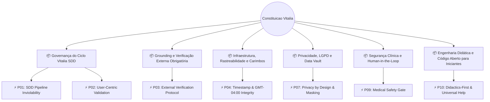

<!-- architect-constitution.md | Compilado em: 28-08-2026 09:07:18(GMT-04:00) -->
# 📜 Constituição de Arquitetura, Segurança e Governança Vitalia

**Data/Hora de Geração:** `28-08-2026 09:07:18(GMT-04:00)` | **Fuso Horário:** America/Cuiaba `(GMT-04:00)`

> ⚠️ **DOCUMENTO GERADO DETERMINISTICAMENTE:** Não edite este arquivo diretamente. Edite `constitution_data.yaml`.

---

## 🗺️ Mapa de Governança Constitucional

---

## 📑 Módulos Constitucionais e Regras Invioláveis

<h3>📦 Governança do Ciclo Vitalia SDD</h3>

> _Princípios invioláveis de arquitetura guiada por especificação e validação contínua._

| ID | Princípio | Nível | Severidade | Regra | Validador |
|---|---|---|---|---|---|
| `P01` | **SDD Pipeline Inviolability** | `MUST` | `BLOCKING` | Nunca implementar código sem tasks.md aprovado pelo Task Verifier. Seguir rigorosamente specify -> plan -> tasks -> implement. | `hooks/llm_judge.py --mode tasks` |
| `P02` | **User-Centric Validation** | `MUST` | `WARNING` | Toda proposta técnica deve declarar explicitamente o impacto ao usuário final e justificar escolhas de design. | `hooks/guardian_context.py` |

<h3>📦 Grounding e Verificação Externa Obrigatória</h3>

> _Protocolo para evitar alucinações técnicas em domínios críticos._

| ID | Princípio | Nível | Severidade | Regra | Validador |
|---|---|---|---|---|---|
| `P03` | **External Verification Protocol** | `MUST` | `WARNING` | Afirmações sobre versões de pacotes, APIs, preços cloud e referências científicas exigem busca externa e Rastro de Pesquisa. | `hooks/guardian_context.py` |

<h3>📦 Infraestrutura, Rastreabilidade e Carimbos</h3>

> _Normas de integridade temporal e identificação de artefatos._

| ID | Princípio | Nível | Severidade | Regra | Validador |
|---|---|---|---|---|---|
| `P04` | **Timestamp & GMT-04:00 Integrity** | `MUST` | `WARNING` | Todos os arquivos e interações devem conter carimbo temporal no fuso imutável America/Cuiaba (GMT-04:00) e data/hora visíveis no corpo. | `maintenance/header_stamp.py` |

<h3>📦 Privacidade, LGPD e Data Vault</h3>

> _Proteção de dados do participante e soberania sobre informações sensíveis._

| ID | Princípio | Nível | Severidade | Regra | Validador |
|---|---|---|---|---|---|
| `P07` | **Privacy by Design & Masking** | `MUST` | `BLOCKING` | Dados sensíveis e PHI nunca devem ser armazenados sem consentimento explícito. Respostas devem ser sanitizadas por padrão. | `hooks/llm_judge.py --mode after_task` |

<h3>📦 Segurança Clínica e Human-in-the-Loop</h3>

> _Salvaguardas médicas obrigatórias para saúde digital._

| ID | Princípio | Nível | Severidade | Regra | Validador |
|---|---|---|---|---|---|
| `P09` | **Medical Safety Gate** | `MUST` | `BLOCKING` | Recomendações clínicas, diagnósticos ou dosagens exigem status DRAFT, disclaimer educacional e aprovação humana explícita. | `hooks/llm_judge.py --mode tasks` |

<h3>📦 Engenharia Didática e Código Aberto para Iniciantes</h3>

> _Clareza pedagógica e documentação acessível em 100% dos scripts._

| ID | Princípio | Nível | Severidade | Regra | Validador |
|---|---|---|---|---|---|
| `P10` | **Didactics-First & Universal Help** | `MUST` | `WARNING` | 100% dos scripts do Kit devem implementar flag --help didática com exemplos práticos, e todo código deve conter comentários inline didáticos passo a passo. | `hooks/llm_judge.py --mode after_task` |

